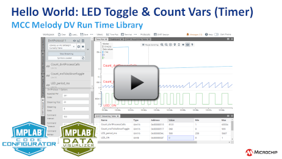

<!-- MPAE-20361 Please do not change this logo with link -->

<a target="_blank" href="https://www.microchip.com/" id="top-of-page">
   <picture>
      <source media="(prefers-color-scheme: light)" srcset="images/mchp_logo_light.png" width="350">
      <source media="(prefers-color-scheme: dark)" srcset="images/mchp_logo_dark.png" width="350">
      
   </picture>
</a>

# DVRT Hello World: LED Toggle and Count Variables (Timer)

[DVRT (Data Visualizer Run Time)](https://onlinedocs.microchip.com/v2/keyword-lookup?keyword=MDV:DVRT:PROTOCOL&version=latest&redirect=true) is a simple bi-directional protocol suited for small microcontrollers. It supports streaming as well as reading and writing of global variables (memory locations) of the target application.

With the DVRT protocol the set of streamed variables or memory locations, as well as the streaming speed, can be updated dynamically at run time. This is different from the [Data Streamer protocol](https://onlinedocs.microchip.com/v2/keyword-lookup?keyword=MDV:VARIABLE_STREAMERS&version=latest&redirect=true), where the variables that are being streamed are defined at compile time.

**In this example:** A LED is toggled after LED_period_ms (period of LED toggling in ms). LED_ON holds the state of the LED pin, meaning that when it is set to 0, an active low LED is on, and vice versa. Every 1 ms: DVRT_process( ) is called via a flag (msTick) set in the timer callback.
Count_msTicksSinceToggle is incremented up to toggle_ms, when LED_ON is toggled.  

  

## Related Documentation
- [MCC Melody API Reference for DV Run Time Library](https://onlinedocs.microchip.com/v2/keyword-lookup?keyword=DV-RUN-TIME-LIBRARY&version=latest&redirect=true)

     - [DVRT Hello World: LED Toggle and Count Variables (Timer)](https://onlinedocs.microchip.com/v2/keyword-lookup?keyword=SCF-LIBRARY-DVRT-USECASES.DVRT_USECASES_1&version=latest&redirect=true): Example code.
     - [Data Visualizer Setup for DV Run Time](https://onlinedocs.microchip.com/v2/keyword-lookup?keyword=DV.SETUP.DVRUNTIME&version=latest&redirect=true) 

## Software Used

- [MCC Melody DV Run Time Library v2.0.0 or newer](https://onlinedocs.microchip.com/v2/keyword-lookup?keyword=DV-RUN-TIME-LIBRARY&version=latest&redirect=true)
- [MPLAB® Data Visualizer v1.4.1926 or newer](https://www.microchip.com/en-us/tools-resources/debug/mplab-data-visualizer)
- [MPLAB® X IDE v6.25 or newer](http://www.microchip.com/mplab/mplab-x-ide)
- [MPLAB® XC8 v3.00 or a newer compiler](http://www.microchip.com/mplab/compilers)
- [MPLAB® Code Configurator (MCC) v5.6.2 or newer](https://www.microchip.com/mplab/mplab-code-configurator)

## Hardware Used

- PIC18F57Q43 Curiosity Nano ([DM164150](https://www.microchip.com/en-us/development-tool/DM164150))

## Setup

This example has simply followed the configuration instructions from the following DV Run Time Library API Reference Use Case. 
- [DVRT Hello World: LED Toggle and Count Variables (Timer)](https://onlinedocs.microchip.com/v2/keyword-lookup?keyword=SCF-LIBRARY-DVRT-USECASES.DVRT_USECASES_1&version=latest&redirect=true):  API Reference Use Case, with code snippets and configuration instructions. 

## Operation

What the example should look like when running: 

- [Data Visualizer Setup for DV Run Time](https://onlinedocs.microchip.com/v2/keyword-lookup?keyword=DV.SETUP.DVRUNTIME&version=latest&redirect=true): To configure the MPLAB Data Visualizer to display DV Run Time variables.  

## Summary

In this example, the DVRT protocol successfully demonstrates bi-directional communication by streaming and dynamically modifying global variables such as `LED_period_ms`, `LED_ON`, and `Count_msTicksSinceToggle` at runtime, while `DVRT_process()` is called every 1 ms via a timer-driven flag. The LED is correctly toggled based on the configurable `LED_period_ms`, with `LED_ON` accurately reflecting the active-low state, confirming full support for real-time variable streaming and control—distinct from compile-time-defined streaming in the Data Streamer protocol.

